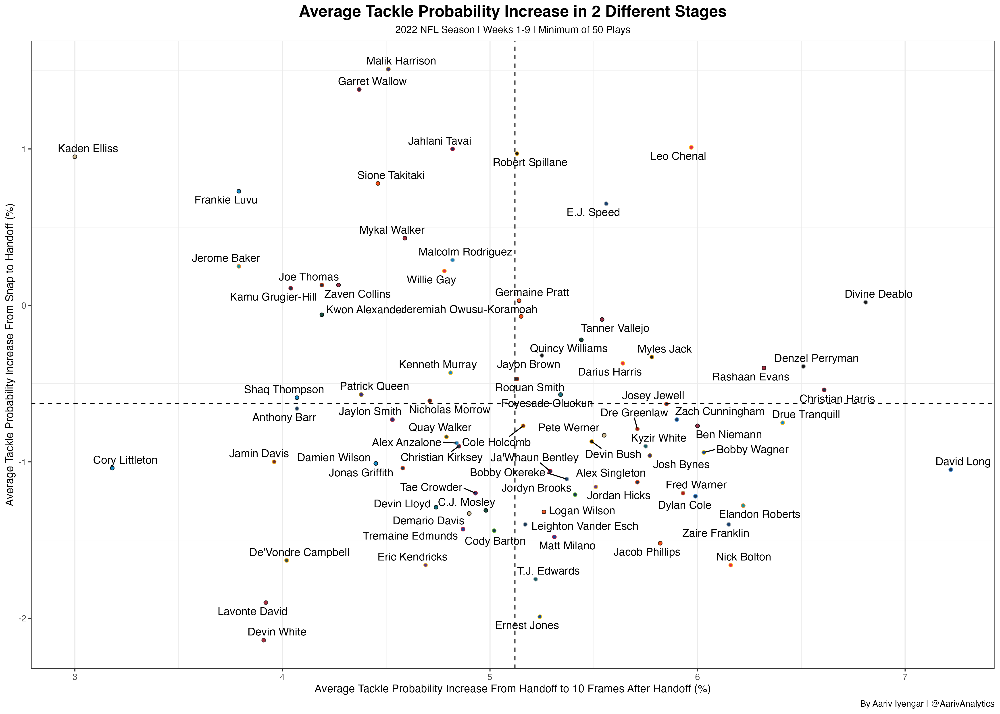

## Introduction

What does it mean to be a good run defender? For a long time, people assumed that high tackle numbers were directly correlated to good run defense. However, we now know this isn't the case. Tackle numbers can be extremely dependent on the situation. For example, a bad defensive line allows opposing running backs to reach the second level of the defense more often, resulting in more tackle opportunities for the linebackers. Using the tracking data made available through this competition, I attempted to find a way to quantify the effectiveness of off-ball linebackers in run defense.

```{r include=FALSE}
library(tidyverse)
```

```{r include=FALSE}
library(readr)
games <- read_csv("~/Downloads/nfl-big-data-bowl-2024/games.csv")
players <- read_csv("~/Downloads/nfl-big-data-bowl-2024/players.csv")
plays <- read_csv("~/Downloads/nfl-big-data-bowl-2024/plays.csv")
tackles <- read_csv("~/Downloads/nfl-big-data-bowl-2024/tackles.csv")
tracking_week_1 <- read_csv("~/Downloads/nfl-big-data-bowl-2024/tracking_week_1.csv")
tracking_week_2 <- read_csv("~/Downloads/nfl-big-data-bowl-2024/tracking_week_2.csv")
tracking_week_3 <- read_csv("~/Downloads/nfl-big-data-bowl-2024/tracking_week_3.csv")
tracking_week_4 <- read_csv("~/Downloads/nfl-big-data-bowl-2024/tracking_week_4.csv")
tracking_week_5 <- read_csv("~/Downloads/nfl-big-data-bowl-2024/tracking_week_5.csv")
tracking_week_6 <- read_csv("~/Downloads/nfl-big-data-bowl-2024/tracking_week_6.csv")
tracking_week_7 <- read_csv("~/Downloads/nfl-big-data-bowl-2024/tracking_week_7.csv")
tracking_week_8 <- read_csv("~/Downloads/nfl-big-data-bowl-2024/tracking_week_8.csv")
tracking_week_9 <- read_csv("~/Downloads/nfl-big-data-bowl-2024/tracking_week_9.csv")
```

```{r include=FALSE}
tracking_data_total <- rbind(tracking_week_1,tracking_week_2,tracking_week_3,tracking_week_4,tracking_week_5,tracking_week_6,tracking_week_7,tracking_week_8,tracking_week_9)%>%
group_by(playId,frameId)
rm(tracking_week_1)
rm(tracking_week_2)
rm(tracking_week_3)
rm(tracking_week_4)
rm(tracking_week_5)
rm(tracking_week_6)
rm(tracking_week_7)
rm(tracking_week_8)
rm(tracking_week_9)
```

```{r include=FALSE}
tracking_data_total <- tracking_data_total %>%
  mutate(
    x = ifelse(playDirection == "left", 120 - x, x),
    y = ifelse(playDirection == "left", 160 / 3 - y, y),
    dir = ifelse(playDirection == "left", dir + 180, dir),
    dir = ifelse(dir > 360, dir - 360, dir),
    o = ifelse(playDirection == "left", o + 180, o),
    o = ifelse(o > 360, o - 360, o)
  )
```

```{r include=FALSE}
tracking_data<- left_join(tracking_data_total,players,by=c("nflId"))
```

```{r include=FALSE}
tracking_data <- left_join(tracking_data,plays,by=c("gameId","playId"))%>%
filter(is.na(passResult))%>%
select(-c("displayName.y"))%>%
rename("displayName"="displayName.x")%>%
filter(club==defensiveTeam|displayName=="football")
rm(plays)
```

```{r include=FALSE}
gameId <- list()
playId <- list()
frameId <- list()
footballX <- list()
footballY <- list()
footballS <- list()
footballA <- list()
n = 1
i = 1

while (n <= nrow(tracking_data)) {
    if (tracking_data$displayName[n] == "football") {
        gameId[i] <- tracking_data$gameId[n]
        playId[i] <- tracking_data$playId[n]
        frameId[i] <- tracking_data$frameId[n]
        footballX[i] <- tracking_data$x[n]
        footballY[i] <- tracking_data$y[n]
        footballS[i] <- tracking_data$s[n]
        footballA[i] <- tracking_data$a[n]
        i = i + 1
    }
    n = n + 1
}

```

```{r include=FALSE}
gameId <- unlist(gameId)
playId <- unlist(playId)
frameId <- unlist(frameId)
footballX <- unlist(footballX)
footballY <- unlist(footballY)
footballA <- unlist(footballA)
footballS <- unlist(footballS)
footballPos <- cbind(gameId,playId,frameId,footballX,footballY,footballA,footballS)
footballPos <- data.frame(footballPos)
tracking_data <- left_join(tracking_data,footballPos,by=c("gameId","playId","frameId"))%>%
mutate(disFromBall = sqrt((x-footballX)^2+(y-footballY)^2))%>%
mutate(angleToBall = (atan((y-footballY)/(x-footballX)))*(180/pi))%>%
filter(!is.na(angleToBall))
rm(footballPos)
rm(gameId)
rm(playId)
rm(frameId)
rm(footballA)
rm(footballS)
rm(footballX)
rm(footballY)
```

```{r include=FALSE}
tracking_data$angleToBall <- ifelse(tracking_data$angleToBall <= 0, tracking_data$angleToBall + 360, tracking_data$angleToBall)
```

```{r include=FALSE}
tracking_tackles <- left_join(tracking_data,tackles,by=c("gameId","playId","nflId"))
tracking_tackles$tackle[is.na(tracking_tackles$tackle)] <- 0
tracking_tackles$assist[is.na(tracking_tackles$assist)]<- 0
rm(tackles)
rm(tracking_data)
```

```{r include=FALSE}
tracking_tackles <- tracking_tackles%>%
mutate(ballO = abs(o-angleToBall))%>%
mutate(DirToBall = abs(dir-angleToBall))%>%
mutate(tackle_assist = tackle+assist)
```

```{r include=FALSE}
tracking_tackles <- left_join(tracking_tackles,games,by=c("gameId"))
tackle_train <- tracking_tackles%>%
filter(week<=6)
tackle_test <- tracking_tackles%>%
filter(week>6)%>%
filter(position=="ILB"|position=="MLB"|position=="OLB")
rm(tracking_tackles)
```

## Logistic Regression Model

To start, I built a logistic regression model to predict the probability of a tackle at every frame of a play. The model incorporated the following variables:

-   DirToBall - The angle of the direction of the player's motion minus the angle needed to run directly at the ball, identifying if the player is moving in the right direction

-   ballO - The angle of the player's orientation minus the angle needed to be facing directly at the ball, quantifying the angle being taken by the player

-   disFromBall - The straight-line distance between the player and the ball

-   s - The speed of the player

-   a - The acceleration of the player

-   footballS - The speed of the ball

-   footballA - The acceleration of the ball

In all of these variables, the ball is used as a stand-in for the ball-carrier.

```{r echo=FALSE}
log_tackle <- glm(tackle_assist~DirToBall+ballO+disFromBall+s+a+footballS+footballA,data=tackle_train,family="binomial")
summary.glm(log_tackle)
```

```{r include=FALSE}
predictions <- predict(log_tackle,newdata=tackle_test,type="response")
tackle_test$tackle_probs <- predictions
tackle_test <- tackle_test%>%
arrange(tackle_probs)
rm(predictions)
```

```{r include=FALSE}
tackle_train <- tackle_train%>%
  filter(position=="ILB"|position=="MLB"|position=="OLB")
predictions <- predict(log_tackle,newdata=tackle_train,type="response")
tackle_train$tackle_probs <- predictions
rm(predictions)
total_tackle_probs <- rbind(tackle_train,tackle_test)%>%
  arrange(tackle_probs)
rm(tackle_train)
rm(tackle_test)

```

```{r include=FALSE}
tracking_data_football <- tracking_data_total%>%
  filter(displayName=="football")
tracking_data_no_lbs <- left_join(tracking_data_total,players,by=c("nflId"))%>%
filter(position!="ILB"&position!="OLB"&position!="MLB"|displayName.x=="football")
tracking_data_no_lbs <- rbind(tracking_data_no_lbs,tracking_data_football)%>%
  select(-c("displayName","displayName.y"))%>%
  rename("displayName"="displayName.x")
rm(tracking_data_total)
rm(tracking_data_football)
rm(players)
data_viz <- rbind(total_tackle_probs,tracking_data_no_lbs)
rm(tracking_data_no_lbs)
```

```{r include=FALSE}
library(sportyR)
library(ggrepel)
field_params <- list(field_apron = "springgreen3",
                     field_border = "springgreen3",
                     offensive_endzone = "springgreen3",
                     defensive_endzone = "springgreen3",
                     offensive_half = "springgreen3",
                     defensive_half = "springgreen3")
nfl_field <- geom_football(league = "nfl",
                           display_range = "in_bounds_only",
                           x_trans = 60,
                           y_trans = 26.6667,
                           xlims = c(40, 100),
                           color_updates = field_params)
```

## Example Play

To see how this model can be used to inform us about run defense, here's a Kenneth Walker run from a week 5 game between the Seahawks and the Saints. Pete Werner is highlighted in brown on the Saints defense. The size of the dot of each linebacker corresponds to their tackle probability at that time.

```{r include=FALSE}
example_play <- data_viz %>% 
  filter(gameId == 2022100906, playId == 2893, !is.na(displayName)) %>% 
  mutate(
    pt_color = case_when(
      club == "NO" ~ "gold",
      club == "SEA" ~ "green",
      club == "football" ~ "brown"
    ),
    pt_size = ifelse(
      is.na(tackle_probs),
      3,
      scales::rescale(
        tackle_probs, 
        to = c(3, 8), 
        from = range(data_viz$tackle_probs, na.rm = TRUE, finite = TRUE)
      )
    ),
    pt_color = ifelse(nflId == 53489, "white", pt_color),
    pt_size = ifelse(club == "football", 2, pt_size),
  )

library(gganimate)
animation <- nfl_field +
  geom_point(
    data = example_play,
    aes(x = 120 - x, y = 160 / 3 - y,
        size = pt_size,
        color = pt_color)
  ) +
  transition_time(example_play$frameId) +
  scale_color_manual(values = c("gold", "green", "brown", "white")) +
  guides(color = "none", size = "none")
anim_save("werner.gif", animation)

```


```{r include=FALSE}
werner <- example_play%>%
  filter(displayName=="Pete Werner")%>%
  arrange(frameId)
```

Werner is able to shoot the gap and get a clear shot at Walker, slowing him down for long enough for other Saints players to win their matchups and tackle Walker. Despite this very clearly being a good play by Werner, he doesn't get any credit for it in the box score. However, we can use the frame-by-frame tackle probabilities to properly credit him. At the snap, Werner has a tackle probability of about 10.85%. By the handoff, that's up to 12.73%. By frame 29, 10 frames after the snap, it's all the way up to 30.07%. These probabilities are able to illustrate the impact Werner had on this play in a way that traditional tackles can't.

```{r include=FALSE}
rm(data_viz)
rm(example_play)
rm(field_params)
rm(animation)
rm(nfl_field)
```

```{r include=FALSE}
library(dplyr)

frame10 <- data.frame()

total_tackle_probs <- total_tackle_probs %>%
  group_by(nflId, playId, gameId) %>%
  arrange(nflId, playId, gameId, frameId) %>%
  ungroup()

i <- 1
while (i <= nrow(total_tackle_probs) - 10) {
  if (!is.na(total_tackle_probs$event[i]) && total_tackle_probs$event[i] == "handoff") {
    frame10 <- rbind(frame10, total_tackle_probs[i + 10, , drop = FALSE])
  }
  i <- i + 1
}
frame10 <- frame10%>%
  rename("tackle_probs_frame10"="tackle_probs")%>%
  select(gameId,playId,nflId,frameId,tackle_probs_frame10)

ballSnap <- total_tackle_probs%>%
  filter(event=="ball_snap")%>%
  select(gameId,playId,nflId,frameId,tackle_probs)%>%
  rename("tackle_probs_ball_snap"="tackle_probs")

```

```{r include=FALSE}
tackle_stages <- total_tackle_probs%>%
  filter(event=="handoff")%>%
  filter(!is.na(tackle_probs))
rm(total_tackle_probs)
tackle_stages <- left_join(tackle_stages,frame10,by=c("gameId","playId","nflId"))%>%
  mutate(probIncrease_frame10 = tackle_probs_frame10-tackle_probs)
tackle_stages <- left_join(tackle_stages,ballSnap,by=c("gameId","playId","nflId"))%>%
  mutate(probIncrease_handoff = tackle_probs-tackle_probs_ball_snap)
rm(ballSnap)
rm(frame10)
```

## Tackle Probability Increase

Using what was learned by analyzing the Werner play, we can come up with 2 separate metrics to evaluate run defense. First, looking at the tackle probability increase from snap to handoff. This can be a measure of how well a linebacker is able to quickly diagnose a play. Here's a table of the 6 best and 6 worst probability increases in this window during the timeframe covered by the datasets.

```{r echo=FALSE}
{library(nflfastR)
library(gt)
library(gtExtras)
library(scales)
library(gtsummary)
tackle_stages <- left_join(tackle_stages,teams_colors_logos,by=c("club"="team_abbr"))%>%
    filter(nflId!=53611,nflId!=47890,nflId!=54503,nflId!=53534,nflId!=54505,nflId!=46074,nflId!=47799,nflId!=43354,
         nflId!=35493,nflId!=44834,nflId!=52525,nflId!=42431,nflId!=52456,nflId!=53447,nflId!=43333,nflId!=53461,
         nflId!=47790,nflId!=47939,nflId!=54470,nflId!=41231,nflId!=54644,nflId!=48089,nflId!=42401,nflId!=46205,
         nflId!=43435,nflId!=38548,nflId!=53441,nflId!=53460,nflId!=47878,nflId!=42381,nflId!=47795,nflId!=37087,
         nflId!=41915,nflId!=52492,nflId!=54466,nflId!=52563,nflId!=46117,nflId!=53639,nflId!=37075,nflId!=52446,
         nflId!=42465,nflId!=44825,nflId!=52510,nflId!=46135,nflId!=52495,nflId!=53564,nflId!=44842,nflId!=53547,nflId!=41269)%>%
  filter(!is.na(probIncrease_handoff),!is.na(probIncrease_frame10))
worst_plays_handoff <- tackle_stages%>%
  arrange(probIncrease_handoff)%>%
  slice_head(n=6)
best_plays_handoff <- tackle_stages%>%
  arrange(probIncrease_handoff)%>%
  slice_tail(n=6)
handoff_data <- rbind(best_plays_handoff, worst_plays_handoff)
best_play_handoff_gt <- handoff_data%>%
  arrange(-probIncrease_handoff)%>%
  select(displayName,team_wordmark,down,quarter,possessionTeam,playResult,probIncrease_handoff)%>%
  mutate(probIncrease_handoff = probIncrease_handoff*100)%>%
  mutate(probIncrease_handoff = round(probIncrease_handoff,digits=2))%>%
  gt()%>%
  cols_align(align = "center")%>%
  gt_img_rows(team_wordmark)%>%
  cols_label(displayName = "Player",
             team_wordmark = "",
             down = "Down",
             quarter = "Quarter",
             possessionTeam = "Opponent",
             playResult = "Yards Gained",
             probIncrease_handoff = "Tackle Probability Increase From Snap to Handoff (%)")%>%
  gt_theme_538()%>%
  gt_hulk_col_numeric(probIncrease_handoff)
gtsave(best_play_handoff_gt,file="best_plays_handoff.png")
rm(best_play_handoff_gt)
rm(best_plays_handoff)
rm(worst_plays_handoff)}
```


Next, we can look at how well the play is covered after the handoff. Using an arbitrary difference of 10 frames, here are the 6 best and worst plays over the same timeframe by this metric.

```{r echo=FALSE}
{
worst_plays_frame10 <- tackle_stages%>%
  arrange(probIncrease_frame10)%>%
  slice_head(n=6)
best_plays_frame10 <- tackle_stages%>%
  arrange(probIncrease_frame10)%>%
  slice_tail(n=6)
best_play_frame10_gt <- rbind(best_plays_frame10,worst_plays_frame10)%>%
  arrange(-probIncrease_frame10)%>%
  filter(!is.na(probIncrease_frame10))%>%
  mutate(probIncrease_frame10 = probIncrease_frame10*100)%>%
  mutate(probIncrease_frame10 = round(probIncrease_frame10,digits=2))%>%
  select(displayName,team_wordmark,down,quarter,possessionTeam,playResult,probIncrease_frame10)%>%
  gt()%>%
  cols_align(align="center")%>%
  gt_img_rows(team_wordmark)%>%
  cols_label(displayName="Player",
             team_wordmark="",
             down = "Down",
             quarter = "Quarter",
             possessionTeam = "Opponent",
             playResult = "Yards Gained",
             probIncrease_frame10 = "Tackle Probability Increase From Handoff to 10 Seconds After Handoff (%)")%>%
  gt_theme_538()%>%
  gt_hulk_col_numeric(probIncrease_frame10)
gtsave(best_play_frame10_gt,file="best_plays_frame10.png")
rm(best_play_frame10_gt)
rm(best_plays_frame10)
rm(worst_plays_frame10)
}
```


```{r include=FALSE}
mean_data <- tackle_stages%>%
  group_by(nflId)%>%
  filter(!is.na(probIncrease_frame10),!is.na(probIncrease_handoff))%>%
  summarize(name=first(displayName),
            team=first(club),
            mean_prob_increase_handoff=mean(probIncrease_handoff),
            mean_prob_increase_frame10 = mean(probIncrease_frame10),
            plays = n())%>%
  filter(plays>=50)%>%
  arrange(mean_prob_increase_frame10,descending=FALSE)
rm(tackle_stages)
```

## Results

Looking at these metrics at the play-by-play level is interesting, but it's likely more useful to look at them at a larger scale. This can be done by taking the mean probability increase across each stage. Using this strategy, these are the 6 best and worst players in run defense by the handoff-to-snap metric.

```{r echo=FALSE}
{mean_data <- left_join(mean_data,teams_colors_logos,by=c("team"="team_abbr"))%>%
  arrange(-mean_prob_increase_handoff)%>%
  mutate(rank=row_number())%>%
  mutate(mean_prob_increase_handoff = mean_prob_increase_handoff*100)%>%
  mutate(mean_prob_increase_handoff = round(mean_prob_increase_handoff,digits=2))%>%
  mutate(mean_prob_increase_frame10 = mean_prob_increase_frame10*100)%>%
  mutate(mean_prob_increase_frame10 = round(mean_prob_increase_frame10,digits=2))

bottom_tackle_prob_handoff <- mean_data%>%
  arrange(mean_prob_increase_handoff)%>%
  slice_head(n=6)
top_tackle_prob_handoff <- mean_data%>%
  arrange(mean_prob_increase_handoff)%>%
  slice_tail(n=6)
handoff_data <- rbind(top_tackle_prob_handoff,bottom_tackle_prob_handoff)
tackle_prob_handoff_gt <- handoff_data%>%
  arrange(-mean_prob_increase_handoff)%>%
  select(rank,name,team_wordmark,mean_prob_increase_handoff)%>%
  gt()%>%
  cols_align(align="center")%>%
  gt_img_rows(team_wordmark)%>%
  cols_label(rank="rank",
             name="Player",
             team_wordmark="",
             mean_prob_increase_handoff = "Average Tackle Probability Increase From Snap to Handoff (%)")%>%
  gt_theme_538()%>%
  gt_hulk_col_numeric(mean_prob_increase_handoff)
gtsave(tackle_prob_handoff_gt,file="mean_increase_handoff.png")
rm(bottom_tackle_prob_handoff)
rm(top_tackle_prob_handoff)
rm(handoff_data)
}
```


And here are the 6 best and worst players by the handoff-to-post-handoff metric.

```{r echo=FALSE}
{mean_data <- mean_data%>%
  arrange(-mean_prob_increase_frame10)%>%
  mutate(rank=row_number())
bottom_tackle_prob_frame10 <- mean_data%>%
  arrange(mean_prob_increase_frame10)%>%
  slice_head(n=6)
top_tackle_prob_frame10 <- mean_data%>%
  arrange(mean_prob_increase_frame10)%>%
  slice_tail(n=6)
frame10_data <- rbind(top_tackle_prob_frame10,bottom_tackle_prob_frame10)
tackle_prob_frame10_gt <- frame10_data%>%
  arrange(-mean_prob_increase_frame10)%>%
  select(rank,name,team_wordmark,mean_prob_increase_frame10)%>%
  gt()%>%
  cols_align(align="center")%>%
  gt_img_rows(team_wordmark)%>%
  cols_label(rank="rank",
             name="Player",
             team_wordmark="",
             mean_prob_increase_frame10 = "Average Tackle Probability Increase From Handoff to 10 Frames After Handoff (%)")%>%
  gt_theme_538()%>%
  gt_hulk_col_numeric(mean_prob_increase_frame10)
print(tackle_prob_frame10_gt)
gtsave(tackle_prob_frame10_gt,file="mean_increase_frame10.png")
rm(bottom_tackle_prob_frame10)
rm(top_tackle_prob_frame10)
rm(frame10_data)
}
```


Finally, to get a better visual of total run defense in off-ball linebackers, we can look at a plot comparing their tackle probability added over each of the 2 stages.

```{r echo=FALSE}
library(ggplot2)
library(ggthemes)
library(ggrepel)
mean_data%>%
  ggplot(aes(x=mean_prob_increase_frame10,y=mean_prob_increase_handoff))+
  geom_point(aes(fill=team_color,color=team_color2),shape=21,alpha=0.9)+
  scale_color_identity(aesthetics = c("fill","color"))+
  geom_text_repel(aes(label=paste(name)))+
  geom_vline(xintercept=mean(mean_data$mean_prob_increase_frame10),linetype="dashed")+
  geom_hline(yintercept=mean(mean_data$mean_prob_increase_handoff),linetype="dashed")+
  theme_bw()+
  labs(x="Average Tackle Probability Increase From Handoff to 10 Frames After Handoff (%)",
       y="Average Tackle Probability Increase From Snap to Handoff (%)",
       title = "Average Tackle Probability Increase in 2 Different Stages",
       subtitle = "2022 NFL Season | Weeks 1-9 | Minimum of 50 Plays",
       caption="By Aariv Iyengar | @AarivAnalytics")+
  theme(panel.grid.major.y = element_blank(),
        plot.title=element_text(size=16,hjust=0.5,face="bold"),
        plot.subtitle=element_text(size=10,hjust=0.5))
ggsave("tackle_prob_increase_graph.png",width=14,height=10,dpi="retina")
```



One interesting thing to me here is the location of the Buccaneers linebackers, Lavonte David and Devin White. The Bucs have had the reputation of a great run defense for years, so their 2 star linebackers being so bad by these metrics doesn't make much sense at first. However, per rbsdm.com, the Bucs were actually in the bottom half of the league in EPA/Rush allowed (19th) over the timeframe covered by the data. They have one of the best run-stopping nose tackles in the league in Vita Vea, so it can be a safe assumption that their linebacker duo is hurting their overall performance against the run. On the opposite end of the graph, 2 Raiders linebackers in Divine Deablo and Denzel Perryman are rated very highly. The Raiders aren't commonly thought of as a good defense, but they were actually 5th in EPA/Rush allowed over this timeframe. They don't have a great defensive line outside of Maxx Crosby, so it can be inferred that the linebackers are helping boost their run defense a lot.

## Analysis

These metrics do have some issues to be considered. The snap-to-handoff metric can tend to favor players who play closer to the line of scrimmage, especially if the run is to their side of the field. In addition, the 10 frames after the handoff was a completely arbitrary number. Every play is different, so different numbers will work better for different plays.

Despite these issues, tackle probability increase is a more consistent way to evaluate run defense than plain tackles. It can reward a player for making a good play and disrupting a run even if they didn't eventually make the tackle. This allows it to give much more insight into run defense than traditional metrics.

## Appendix

The full code can be found on my [GitHub](https://github.com/aariviyengar/tackle_probability_added/tree/main).
